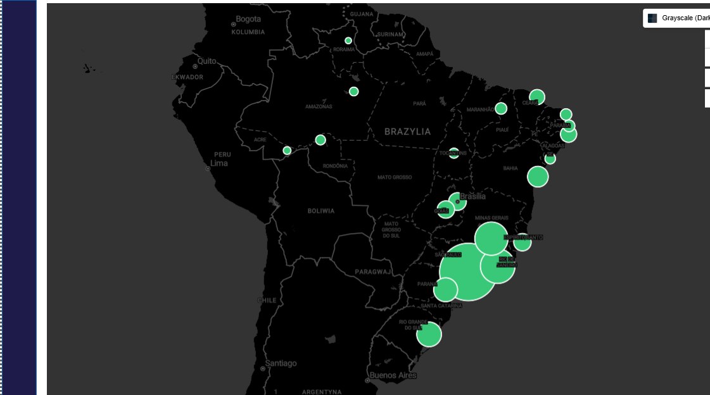
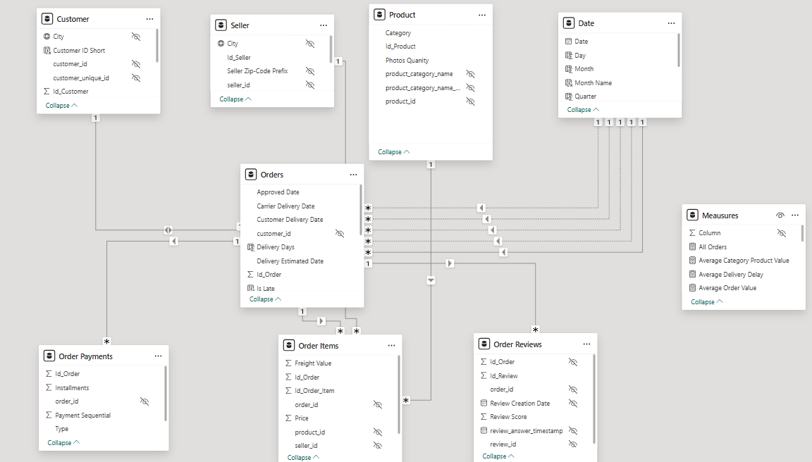
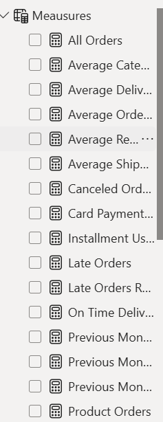
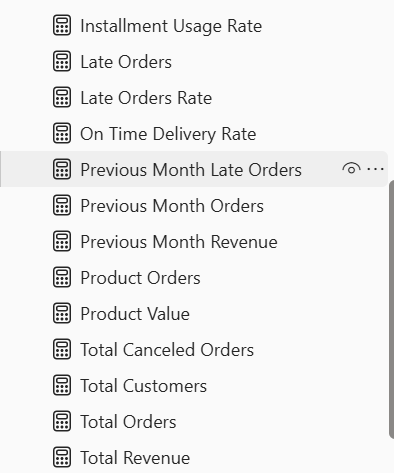
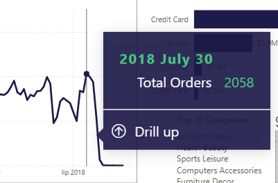
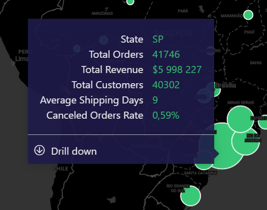

# Olist E-commerce Analytics Dashboard (Power BI)

## Project Overview

This project presents an interactive **Power BI dashboard** built using the **Olist Brazilian E-commerce dataset**.  
The goal of the project was to transform raw transactional data into a structured analytical model and create a dashboard that support business analysis.

The report integrates **data preparation, data modeling, DAX calculations, and interactive visualizations** to support business analysis.
---

## Business Goal

The main objective of this dashboard is to provide a clear overview of the platform's operational and sales performance.

The report helps answer business questions such as:

- Which regions generate the most orders and revenue?
- Which product categories drive the highest sales?
- What payment methods are used most frequently?
- How efficient is the delivery process?
- What percentage of orders are delivered late?

---

## Dataset

The project uses the **Olist Brazilian E-commerce Public Dataset**.

Dataset source:

https://www.kaggle.com/datasets/olistbr/brazilian-ecommerce

The dataset includes information about:

- orders
- customers
- sellers
- products
- payments
- reviews
- geolocation

---

## Tech Stack

The dashboard was built using the following tools:

- **Power BI** – dashboard development and data modeling  
- **Power Query** – data cleaning and transformation  
- **DAX (Data Analysis Expressions)** – calculated measures and business logic  

---

# Geographic Analysis

The report includes a geographic visualization showing the distribution of orders across Brazilian states.

The map uses:

- **bubble size** to represent order volume
- **tooltips** to display additional metrics such as revenue, customers, and delivery performance

This allows quick identification of regions with the highest concentration of orders.

---

# Data Model

The report is built on a relational model integrating multiple tables from the Olist dataset.

### Dimension tables

- Customer  
- Seller  
- Product  
- Date  

### Fact tables

- Orders  
- Order Items  
- Order Payments  
- Order Reviews  

To keep the model organized and easier to maintain, all calculations were placed in a dedicated **Measures** table.

---

# Measures

All DAX calculations were organized in a dedicated table called **Measures**, which improves model readability and separates business logic from raw data tables.

Implemented measures include:

- All Orders
- Average Category Product Value
- Average Delivery Delay
- Average Order Value
- Average Review Score
- Average Shipping Days
- Canceled Orders Rate
- Card Payments Rate
- Installment Usage Rate
- Late Orders
- Late Orders Rate
- On Time Delivery Rate
- Previous Month Late Orders
- Previous Month Orders
- Previous Month Revenue
- Product Orders
- Product Value
- Total Canceled Orders
- Total Customers
- Total Orders
- Total Revenue

These measures power KPI cards, trend charts, payment analysis, delivery metrics, and category-level insights.

---

# Dashboard Visualizations

The dashboard contains several analytical visuals designed to support business analysis.

### KPI Cards

Key performance indicators summarize overall platform performance.

Metrics include:

- Total Revenue
- Total Orders
- Late Orders Rate
- Total Customers

---

### Orders Trend

A line chart presents **weekly order volume**, allowing identification of trends and seasonal demand changes.

---

### Revenue by Payment Type

A bar chart compares revenue generated by different payment methods, including:

- Credit Card
- Boleto
- Voucher
- Debit Card

This helps identify the most commonly used payment options.

---

### Top Product Categories

A table visual presents the top product categories based on:

- order volume
- total revenue
- average order value

---

# Custom Tooltips

Custom tooltip pages were implemented to provide more contextual information without cluttering the main visuals.

### Chart Tooltip

The tooltip used in the order trend chart shows detailed information for the selected date, including the number of orders.

---

### Map Tooltip

The geographic tooltip provides additional regional metrics such as:

- state
- total orders
- total revenue
- total customers
- average shipping days
- canceled orders rate

---

# Data Preparation (Power Query)

Data preparation was performed using **Power Query**.

Main transformation steps included:

- assigning appropriate data types
- removing rows with errors or missing values
- renaming columns into business-friendly labels
- creating surrogate keys using index columns
- merging tables to retrieve internal keys
- standardizing text values
- removing unnecessary columns

The **Category Translation** table was used to translate product categories and was disabled from load after the final category field was created.

The **Geolocation** table was also excluded from the final model because the report focuses on state-level geographic analysis.

---

# Date Modeling

A dedicated **Date dimension** was created in **DAX** to support time-based analysis.

The table includes:

- Date
- Year
- Month
- Day
- Month Name
- Week Day
- Weekend indicator
- Quarter
- Week Number
- Week Start Date

Additionally, datetime fields in the **Orders** table were converted into separate date columns such as:

- Purchase Date
- Approved Date
- Carrier Delivery Date
- Customer Delivery Date
- Delivery Estimated Date

Additional calculated fields were created for delivery analysis:

- Delivery Days
- Is Late
- Late Days

---

# Model Optimization

To keep the semantic model clean and easier to use, several technical columns were hidden from report view.

These include:

- internal ID columns
- foreign keys used only for relationships
- original datetime fields replaced by date columns
- intermediate helper columns

This makes the model easier to navigate and more business-oriented.

---

# Files

- **OLIST.pbit** – Power BI template file containing the report structure, model, and calculations
