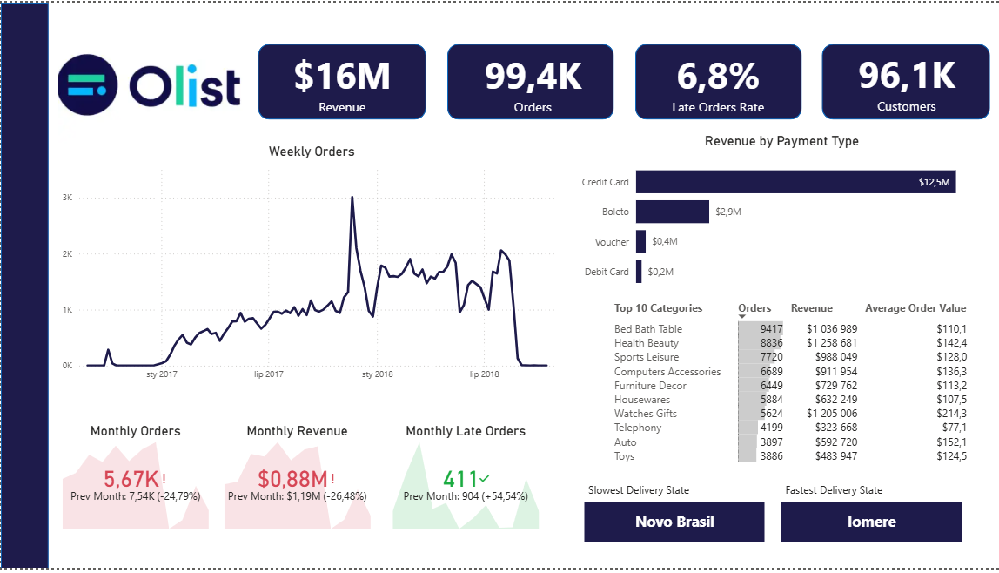

# Olist E-commerce Analytics Dashboard (Power BI)

Interactive Power BI dashboard built on the **Olist Brazilian E-commerce dataset**, designed to analyze sales performance, customer activity, delivery quality, and category-level results.

## Dashboard

The dashboard is presented through a short walkthrough video — click the image below to watch it.

The video presents:
- interactive filters
- hierarchy exploration
- drill-through navigation
- tooltip-based insights
- page navigation buttons
- KPI monitoring across multiple report views

## Note

Since I do not currently use an active Power BI Pro sharing setup, this project is presented as a recorded dashboard walkthrough instead of a live published report.  
The video shows the dashboard’s navigation, filters, drill-through page, tooltips, and key business views.

## Report Structure

The dashboard includes four report pages:

- **Main Dashboard** — overview of revenue, orders, customers, payment methods, and top categories
- **Map** — geographic analysis of orders across Brazil
- **Logistics** — late deliveries, shipping time, and review-related performance
- **Category Detail** — drill-through page from the main dashboard for deeper category analysis

## Key Features

- navigation buttons for page switching
- back button for easier report exploration
- filter panel with **Year** and **State** filters
- drill-through from the main dashboard to category details
- custom tooltips
- KPI cards
- trend analysis
- geographic insights
- logistics and delivery analysis

## Data & Technical Work

The project included:
- data cleaning and transformation in **Power Query**
- building a **multi-fact analytical data model**
- creating supporting dimension tables for reporting and filtering
- developing a dedicated **date table**
- creating multiple **DAX measures** for revenue, orders, customers, delays, shipping time, reviews, and trend analysis
- organizing calculations in a separate **Measures** table for better readability
- improving model usability by hiding technical fields and keeping the report layer more business-friendly

The report combines several fact tables with supporting dimensions to enable analysis from different business perspectives, including sales, logistics, geography, and product categories.

## Tools Used

- **Power BI**
- **Power Query**
- **DAX**

## Dataset

**Olist Brazilian E-commerce Public Dataset**  
Source: Kaggle  
https://www.kaggle.com/datasets/olistbr/brazilian-ecommerce

## Project File
- `OLIST.pbit` — Power BI template file with the dashboard structure, data model, Power Query transformations, and DAX calculations
- `dashboard_video.mp4` — dashboard walkthrough video showing the main interactions and report functionality
- `images/` — screenshots of the four report pages included in the project
